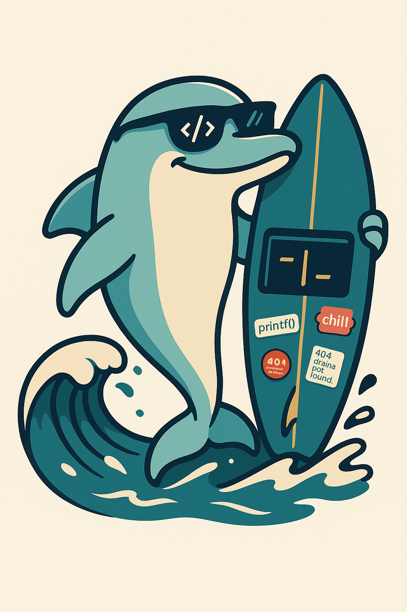

# Vibe Rules Collection by copyleftdev

  

  <em>Surf smarter. Code smoother. Let the vibes guide you.</em>

  

  
  

  
  
  
  
  
  
  
  
  
  
  
  

---

## 🌊 Overview

**Vibe Rules Collection** is a curated library of `.windsurfrules` files designed to guide AI coding assistants—especially [Codeium's Cascade](https://codeium.com)—to generate code that reflects best practices, idiomatic styles, and architectural clarity.

This repo provides a language- and framework-aware vibe system for smoother developer + AI collaboration.

---

## 📦 Contents

- [Purpose](#purpose)
- [Usage](#usage)
- [Rule Categories](#rule-categories)
- [Contributing](#contributing)
- [Code of Conduct](#code-of-conduct)
- [License](#license)

---

## 🎯 Purpose

AI tools accelerate development—but without vibes, they can generate code that’s noisy, offbeat, or even anti-patterned.

**Enter Vibe Rules.**

Each `.windsurfrules` file serves as a lightweight blueprint for:
- Language idioms
- Architectural paradigms
- Design system consistency
- DevOps conventions

Think of these files as surfboards: they help your AI ride the right wave.

---

## 🚀 Usage

1. Clone or reference the relevant `.windsurfrules` files.
2. Integrate with a compatible AI coding assistant (like Cascade in Windsurf IDE).
3. Let your assistant vibe in style.

Configure your project to load rule files automatically or use them contextually via prompts.

---

## 📚 Rule Categories

### API Design
- `graphql_api_design.windsurfrules`
- `rest_api_design.windsurfrules`

### Architecture
- Clean, Hexagonal, Microservices, MVC, SOA, etc.

### Database
- MySQL, PostgreSQL, SQL Server, Oracle PL/SQL, SQLite

### Design Systems
- Material, Apple HIG, Ant Design, Fluent UI, Atlassian

### DevOps
- Git workflows, Terraform, Shell, PowerShell

### Frameworks
- Express, Flask, Rails, Unity, ASP.NET Core

### Language Specific
- Pythonic, Modern C++, Idiomatic Ruby, Modular TypeScript, Rust Clean Arch

### Paradigms
- OOP, Functional, Event-Driven, Data-Oriented

### Performance
- General tuning & SQL optimization

### Quality
- Linting principles

---

## 🤝 Contributing

Pull requests are welcome. Got a vibe you want to share? Submit a `.windsurfrules` file or open a discussion.

See [CONTRIBUTING.md](CONTRIBUTING.md) for guidelines.

---

## 🌈 Code of Conduct

We vibe respectfully. All interactions are governed by the [Code of Conduct](CODE_OF_CONDUCT.md).

---

## 📄 License

MIT License © 2025 copyleftdev

See [LICENSE](LICENSE) for full terms.

---

  <strong>🌀 Keep the code clean. Ride the right patterns. Respect the vibes. 🌀</strong>

